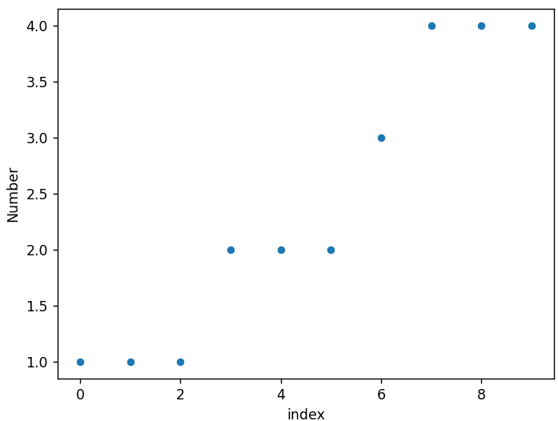
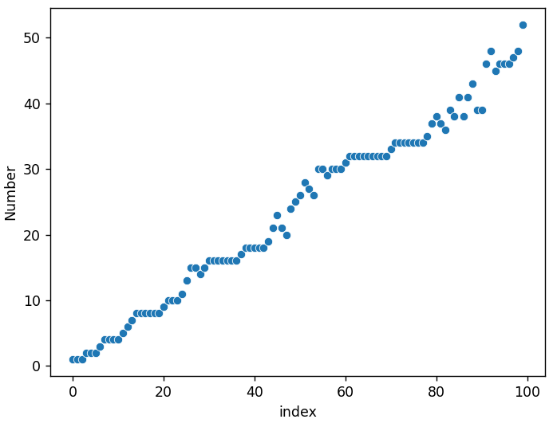
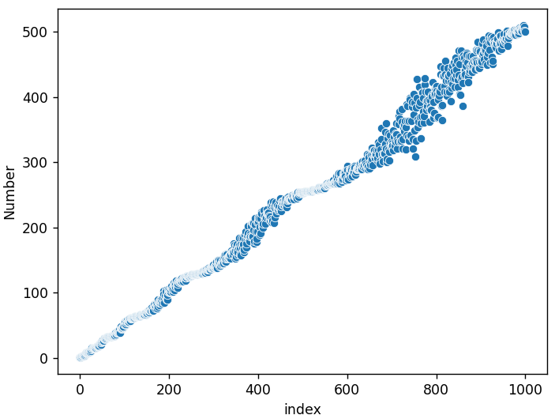
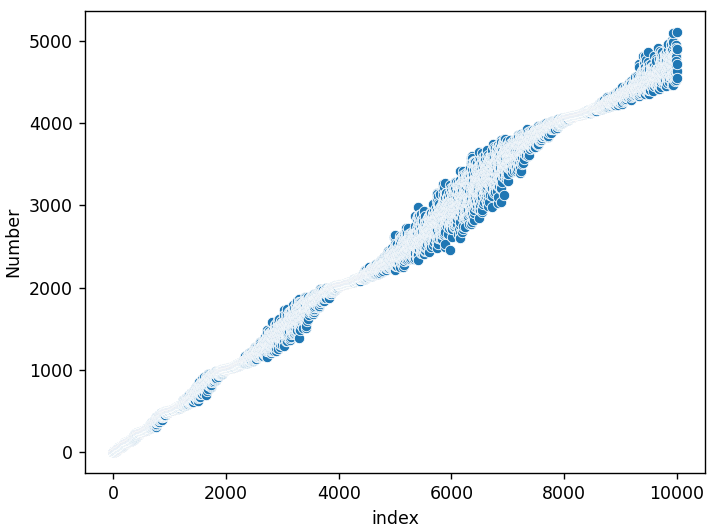
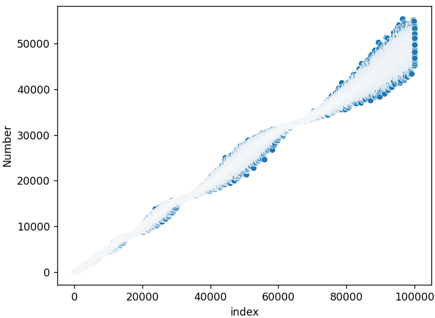

# chaotic-cousin-sequence
This script generates the [chaotic cousin sequence](https://www.youtube.com/watch?v=j0o-pMIR8uk). 

output: `[1, 1, 1, 2, 2, 2, 3, 4, 4, 4, 4, 5, 6, 7, 8, 8, 8, 8, 8, 8, 9, 10, 10, 10, 11, 13, 15, 15, 14, 15]`

# Plotting with Seaborn
## Basic Scatterplots
Scatterplot of 10 numbers:

Scatterplot of 100 numbers:

Scatterplot of 1000 numbers:

Scatterplot of 10000 numbers:

Scatterplot of 100,000 numbers:
