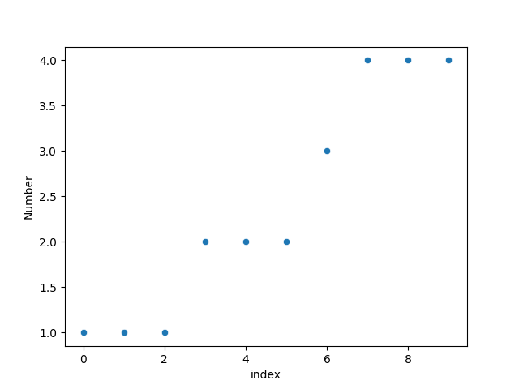
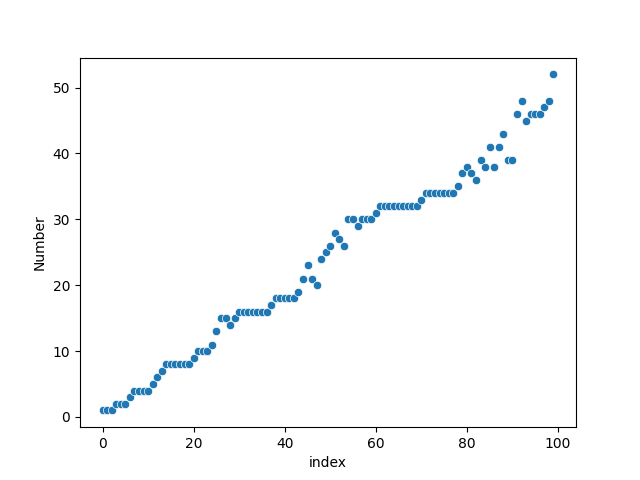
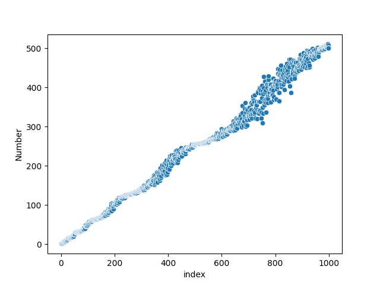

# chaotic-cousin-sequence
This script generates the [chaotic cousin sequence](https://www.youtube.com/watch?v=j0o-pMIR8uk). 

output: `[1, 1, 1, 2, 2, 2, 3, 4, 4, 4, 4, 5, 6, 7, 8, 8, 8, 8, 8, 8, 9, 10, 10, 10, 11, 13, 15, 15, 14, 15, 16, 16, 16, 16, 16, 16, 16, 17, 18, 18, 18, 18, 18, 19, 21, 23, 21, 20, 24, 25, 26, 28, 27, 26, 30, 30, 29, 30, 30, 30, 31, 32, 32, 32, 32, 32, 32, 32, 32, 32, 33, 34, 34, 34, 34, 34, 34, 34, 35, 37, 38, 37, 36, 39, 38, 41, 38, 41, 43, 39, 39, 46, 48, 45, 46, 46, 46, 47, 48, 52]`

# Plotting with Seaborn
## Basic Scatterplots
Scatterplot of 10 numbers:

Scatterplot of 100 numbers:

Scatterplot of 1000 numbers:

Scatterplot of 10000 numbers:

Scatterplot of 100,000 numbers:
